# Domain Events vs Behaviors

> Comparativa didáctica de dos enfoques para manejar efectos colaterales en la creación de pedidos usando .NET, CQRS y DDD.

## 1. Descripción y objetivo del proyecto

**DomainEventsVsBehaviorsDemo** es una demo en .NET 9 que compara dos formas de manejar efectos colaterales al crear un pedido:

- **Con Domain Events + MediatR Notifications** (enfoque recomendado en DDD)
- **Con lógica directa en el Command Handler + Behaviors** (antipatrón)

El objetivo es mostrar, de forma práctica y visual, las diferencias entre ambos enfoques y por qué los Domain Events son la opción correcta en arquitecturas limpias y desacopladas.

## 2. Arquitectura

El proyecto sigue los principios de **Clean Architecture**, **CQRS** y **DDD**:

- **Capa de Dominio**: Entidades, eventos de dominio, lógica de negocio.
- **Capa de Aplicación**: Command Handlers, Behaviors, Handlers de eventos.
- **Infraestructura**: Persistencia (EF Core InMemory).
- **API**: Endpoints minimalistas con Swagger.

Incluye dos endpoints POST:
- `/with-domain-events`: Usa Domain Events correctamente.
- `/with-behavior`: Lógica directa (antipatrón).

## 3. Estructura de carpetas

```text
src/
└── Demo.Api/                 # API + Host
    ├── Application/          # Comandos, Queries, Behaviors
    │   ├── Behaviors/
    │   │   ├── DomainEventsBehavior.cs
    │   │   └── LoggingBehavior.cs
    │   ├── Commands/
    │   │   ├── CreateOrderWithBehavior.cs
    │   │   └── CreateOrderWithDomainEvent.cs
    │   └── DomainEvents/
    │       └── OrderCreatedHandler.cs
    ├── Domain/               # Corazón del negocio (puro)
    │   ├── Entities/
    │   │   ├── AggregateRoot.cs
    │   │   └── Order.cs
    │   └── Events/
    │       ├── DomainEvent.cs
    │       ├── IDomainEvent.cs
    │       └── OrderCreatedEvent.cs
    ├── Infrastructure/      # EF Core, servicios externos
    │   └── Persistence/
    │       └── AppDbContext.cs
    ├── Program.cs
    └── ...
```

## 4. Diagrama de flujo comparativo

```mermaid
flowchart TD
    subgraph Con_Domain_Events
        A1[Command Handler] --> B1[Agregado Order]
        B1 --> C1[Add DomainEvent]
        C1 --> D1[SaveChanges]
        D1 --> E1[Commit OK]
        E1 --> F1[DomainEventsBehavior]
        F1 --> G1[Publicar DomainEvent]
        G1 --> H1[Event Handler OrderCreatedHandler]
    end
    subgraph Sin_Domain_Events
        A2[Command Handler] --> B2[Agregado Order]
        B2 --> C2[SaveChanges]
        C2 --> D2[Lógica directa log, email, etc]
    end
```



## 5. Explicación detallada de Domain Events

[Ver más en docs/domain-events.md](docs/domain-events.md)

## 6. Explicación detallada de Behaviors/Interceptors

[Ver más en docs/behaviors.md](docs/behaviors.md)

## 7. Cómo ejecutar el proyecto paso a paso

[Ver más en docs/ejecucion.md](docs/ejecucion.md)

## 8. Qué observar en la consola

[Ver más en docs/logs.md](docs/logs.md)

## 9. Conclusiones y buenas prácticas

[Ver más en docs/conclusiones.md](docs/conclusiones.md)

## 10. Badges


